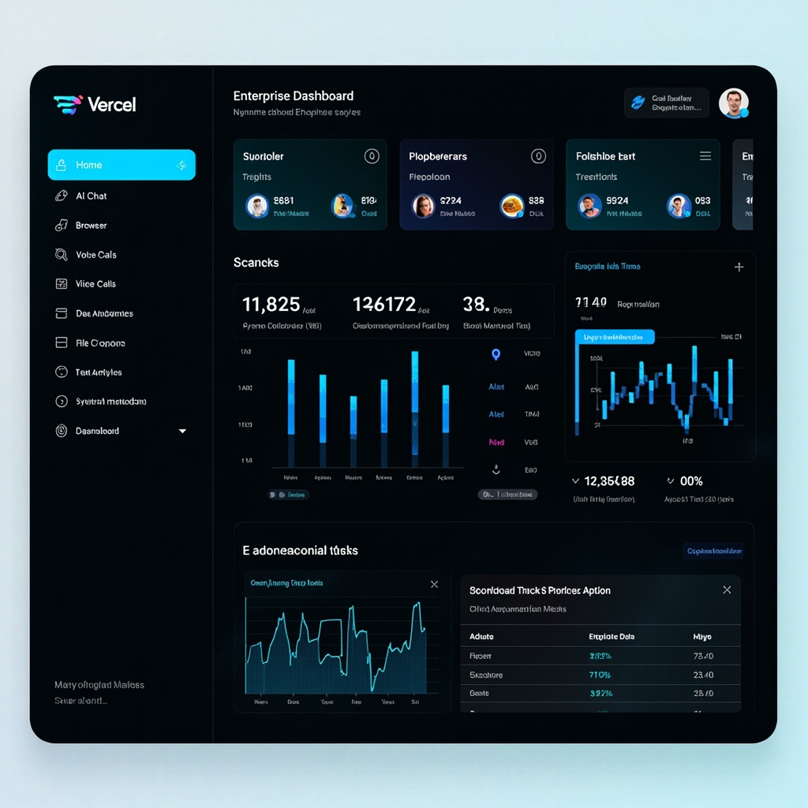
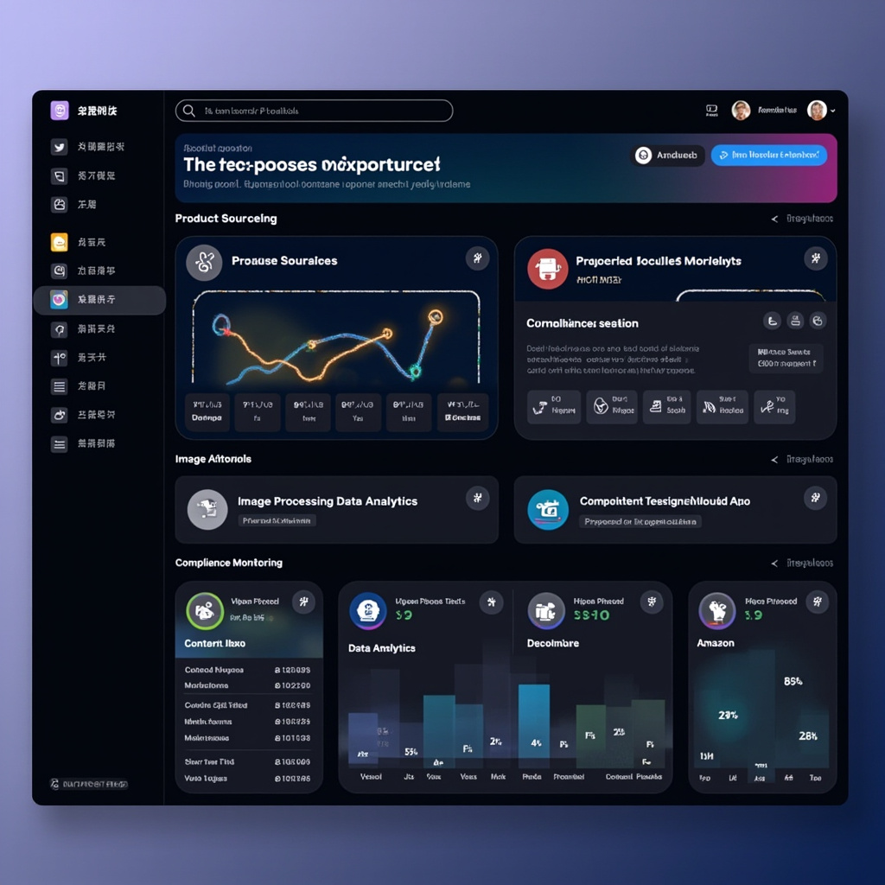

# Lebaic - 企业智能办公系统

> 基于 OpenClaw + Vue3 的企业级智能办公平台，支持 AI 对话、自动化运营、数据分析、团队协作等功能

## 系统概览



## 功能截图

### AI 对话


### 电商运营


### 定时任务


## 功能模块

| 模块 | 功能 | 状态 |
|------|------|------|
| 🤖 **AI 对话** | 多模型 AI 对话，支持 OpenAI/Claude/MiniMax 等 | ✅ |
| 🌐 **浏览器自动化** | Playwright 控制的浏览器操作 | ✅ |
| 📊 **数据分析** | 关键词趋势、运营数据可视化 | ✅ |
| 👥 **Agent 管理** | 多 Agent 协作与任务调度 | ✅ |
| ⏰ **定时任务** | Cron 表达式调度自动化任务 | ✅ |
| 🛒 **电商运营** | 选品挖掘、竞品监控、违禁词检测 | ✅ |
| 📋 **多维表格** | 飞书/钉钉表格集成 | ✅ |
| 💬 **语音通话** | AI 语音交互 | ✅ |
| 📁 **文件管理** | 云端文件存储与共享 | ✅ |
| 👥 **团队协作** | 任务分配与沟通 | ✅ |
| 🦞 **虾格测试** | 有趣的趣味测试 | ✅ |

## 技术架构

```
┌─────────────────────────────────────────────────────────┐
│                    前端 (Vue3)                          │
│  ┌─────────┐ ┌─────────┐ ┌─────────┐ ┌─────────┐        │
│  │  Chat   │ │Dashboard │ │ Ecommerce│ │ Schedule │        │
│  └─────────┘ └─────────┘ └─────────┘ └─────────┘        │
└───────────────────────┬─────────────────────────────────┘
                        │ HTTP/WebSocket
┌───────────────────────┴─────────────────────────────────┐
│               OpenClaw Gateway (Node.js)                  │
│  ┌─────────┐ ┌─────────┐ ┌─────────┐ ┌─────────┐        │
│  │  Tools  │ │  Cron   │ │ Memory  │ │ Skills  │        │
│  └─────────┘ └─────────┘ └─────────┘ └─────────┘        │
└─────────────────────────────────────────────────────────┘
```

## 目录结构

```
lebaic/
├── frontend/                    # Vue3 前端
│   └── src/
│       ├── views/              # 页面组件
│       │   ├── Chat.vue        # AI 对话
│       │   ├── Dashboard.vue   # 数据仪表盘
│       │   ├── Ecommerce.vue   # 电商运营
│       │   └── ScheduleManager.vue  # 定时任务
│       ├── services/           # API 服务
│       └── router/             # 路由配置
└── docs/                       # 截图文档
```

## 快速开始

### 1. 安装依赖

```bash
cd frontend
npm install
```

### 2. 运行

```bash
# 前端开发模式
npm run dev

# 或使用 Docker
docker-compose up -d
```

### 3. 访问

打开浏览器访问 `http://localhost:8080`

## 电商运营功能

### 选品挖掘
- 低粉爆品追踪（粉丝<1000，点赞>10）
- 高粉爆品追踪（类目轮换）
- 四维验证模型

### 内容创作
- 标题去 AI 化
- 白底图生成
- 场景图制作

### 数据分析
- 广告 ROI 分析
- 竞品监控
- 活动监控

### 违规检测
- 客服违禁词检测
- 严重违规/一般违规分类

### 亚马逊运营
- BSR 选品分析
- 自动创建 Listing

## 技术栈

| 层级 | 技术 |
|------|------|
| 前端框架 | Vue 3 + Composition API |
| UI 组件 | Element Plus |
| 样式 | Tailwind CSS |
| 路由 | Vue Router |
| HTTP | Axios |
| 后端 | OpenClaw (Node.js) |
| 自动化 | Playwright (浏览器) |
| 容器 | Docker + Nginx |

## License

MIT License

## GitHub

⭐ https://github.com/llixinhao3-source/lebaic-
