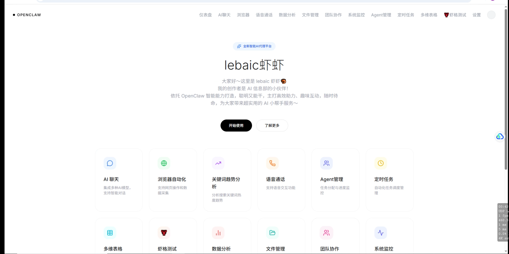

# Lebaic - 企业智能办公系统

> 基于 OpenClaw + Vue3 的企业级智能办公平台，通过 OpenClaw Gateway 连接 AI 模型，支持自动化运营、数据分析等功能

## 系统概览



## 技术架构

```
┌─────────────────────────────────────────────────────────┐
│                    前端 (Vue3)                          │
│  ┌─────────┐ ┌─────────┐ ┌─────────┐ ┌─────────┐      │
│  │  Chat   │ │Dashboard │ │ Ecommerce│ │ Schedule │      │
│  └─────────┘ └─────────┘ └─────────┘ └─────────┘      │
└───────────────────────┬─────────────────────────────────┘
                        │ HTTP/WebSocket
┌───────────────────────┴─────────────────────────────────┐
│               OpenClaw Gateway (Node.js)                  │
│  ┌─────────┐ ┌─────────┐ ┌─────────┐ ┌─────────┐      │
│  │  Tools  │ │  Cron   │ │ Memory  │ │ Skills  │      │
│  └─────────┘ └─────────┘ └─────────┘ └─────────┘      │
│                                                         │
│  支持的 AI 模型:                                        │
│  • MiniMax  • OpenAI  • Anthropic  • 本地模型           │
└─────────────────────────────────────────────────────────┘
```

## 功能模块

| 模块 | 功能 | 状态 |
|------|------|------|
| 🤖 **AI 对话** | 多模型 AI 对话，OpenClaw Gateway 统一接入 | ✅ |
| 🌐 **浏览器自动化** | Playwright 控制的浏览器操作 | ✅ |
| 📊 **数据分析** | 关键词趋势、运营数据可视化 | ✅ |
| 👥 **Agent 管理** | 多 Agent 协作与任务调度 | ✅ |
| ⏰ **定时任务** | Cron 表达式调度自动化任务 | ✅ |
| 🛒 **电商运营** | 选品挖掘、竞品监控、违禁词检测 | ✅ |
| 📋 **多维表格** | 飞书/钉钉表格集成 | ✅ |
| 💬 **语音通话** | AI 语音交互 | ✅ |
| 📁 **文件管理** | 云端文件存储与共享 | ✅ |
| 👥 **团队协作** | 任务分配与沟通 | ✅ |

## 目录结构

```
lebaic/
├── frontend/                    # Vue3 前端
│   └── src/
│       ├── views/             # 页面组件
│       ├── services/           # API 服务
│       └── router/             # 路由配置
├── backend/                    # 业务后端（可选）
│   ├── app.py                # Flask 应用
│   └── ...
└── docs/                      # 截图文档
```

## 快速开始

### 1. 启动 OpenClaw Gateway

```bash
# OpenClaw 已内置 Gateway，直接启动
openclaw gateway start
```

### 2. 启动前端

```bash
cd frontend
npm install
npm run dev
```

### 3. 访问

打开浏览器访问 `http://localhost:8080`

## OpenClaw Gateway 配置

在 `openclaw.json` 中配置 AI 模型：

```json
{
  "providers": {
    "minimax": {
      "apiKey": "your-api-key"
    },
    "openai": {
      "apiKey": "your-api-key"
    },
    "anthropic": {
      "apiKey": "your-api-key"
    }
  }
}
```

## 技术栈

| 层级 | 技术 |
|------|------|
| 前端框架 | Vue 3 + Composition API |
| UI 组件 | Element Plus |
| 网关 | OpenClaw Gateway (Node.js) |
| AI 模型 | MiniMax / OpenAI / Anthropic |
| 自动化 | Playwright (浏览器) |
| 容器 | Docker + Nginx |

## License

MIT License

## GitHub

⭐ https://github.com/llixinhao3-source/lebaic-
